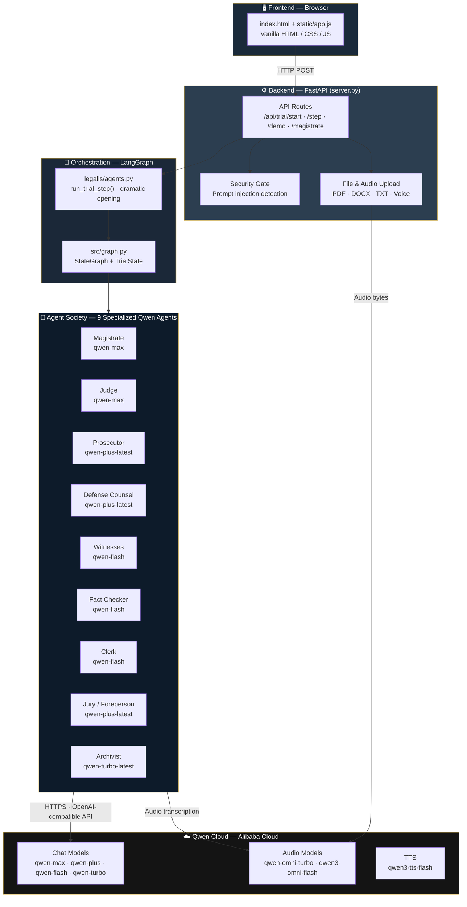

# 🏛️ Codex Legalis: Autonomous Courtroom Simulation

> **A Qwen Cloud Agent Society that runs a full, adversarial legal trial.**

**Codex Legalis** is a multi-agent courtroom simulation built for the **Global AI Hackathon — Track 3: Agent Society**. 

Unlike standard AI tools that simply act as a monolithic legal assistant, Codex Legalis distributes legal labor across **9 specialized Qwen agents**—including a Magistrate, Judge, Prosecutor, Defense Counsel, Witnesses, and a full Jury. These agents debate, object, testify, and deliberate autonomously based on user-provided case facts. The result is a **Shadow Jury Simulation** that computes a mathematically grounded win-probability rather than relying on a single model's arbitrary confidence score.

---

## 🏆 Hackathon Track
**Qwen Cloud Global AI Hackathon - Track 3: Agent Society.**

## 💡 Inspiration & Core Differentiators

While exploring AI in the legal and reasoning sectors, we noticed a critical flaw: typical LLMs evaluate scenarios one-dimensionally. A real courtroom is adversarial, procedural, and bounded by strict rules of evidence. A single AI model cannot effectively roleplay the prosecution, defense, and judge simultaneously without experiencing severe context collapse, bias, or logical shortcuts.

We built Codex Legalis to prove that a **Qwen-powered Agent Society** can execute complex, multi-stage, adversarial reasoning significantly better, safer, and more explainably than a single agent.

**Why it beats the baseline:**
- **True Adversarial Collaboration:** Opposing roles with structured conflict (objections, cross-examinations) and definitive resolution by a Judge agent.
- **Emergent Societal Behavior:** Jury deliberation, hung juries, and witness cross-examination emerge naturally from agent interactions, not rigid scripts.
- **Human-in-the-Loop:** The Magistrate agent asks up to 5 strategic pre-trial clarifying questions. The society handles the rest autonomously.
- **Jurisdiction-Aware:** The simulation dynamically adapts its procedure, evidence rules, and legal standards to the selected country (e.g., Common Law vs. Civil Law, bench trial vs. jury trial).

## 🚀 What The Demo Shows

- **Interactive Courtroom UI:** A beautiful, dark-mode vanilla web interface displaying the live transcript, evidence board, and jury monitor.
- **Qwen Agent Orchestration:** 9 distinct agent personas passing state via a LangGraph state machine.
- **Jurisdiction Selection:** Watch the trial adapt to different countries' legal systems (e.g., US, UK, Nigeria, France).
- **Shadow Jury Outcomes:** A final verdict dashboard showing a win-probability gauge based on independent jury deliberations.
- **Anti-Hallucination Fact-Checking:** A dedicated agent that intercepts and blocks witnesses from inventing facts outside the record in real-time.

## 🏗 Architecture & Tech Stack

Codex Legalis uses a state-machine driven approach where agents do not mutate the core trial state directly. Instead, they propose actions (arguments, objections, testimonies) that are routed and validated.



### Tech Stack

- **LLM Backend:** Qwen Cloud (`dashscope-intl.aliyuncs.com`) using `qwen-max`, `qwen-plus-latest`, and `qwen-flash` for specialized tasks.
- **Audio Transcription:** Qwen Audio / Qwen Omni models via DashScope SDK.
- **Orchestration:** LangGraph (Python) with a strongly typed `TrialState`.
- **Backend:** FastAPI + Uvicorn.
- **Frontend:** Vanilla HTML/JS/CSS (No heavy frameworks, hyper-optimized).

## 🎥 Video/Demo Link
[📺 Watch the Demo on YouTube](YOUR_YOUTUBE_LINK_HERE)

## 📝 Blog Post
[📖 Read the Blog Post](YOUR_BLOG_POST_LINK_HERE)

## 🏛 Agent Society Flow

The simulation routes through the following specialized agents, strictly utilizing Qwen models:

| Agent | Role | Model Assigned |
| :--- | :--- | :--- |
| ⚖️ **Magistrate** | Analyzes the initial case file and asks strategic pre-trial clarifying questions. | `qwen-max` |
| 👨‍⚖️ **Judge** | Rules on objections strictly based on the selected jurisdiction's evidence code and instructs the jury. | `qwen-max` |
| 🦅 **Prosecutor** | Presents evidence, examines witnesses, and builds the case against the defendant. | `qwen-plus-latest` |
| 🛡️ **Defense Counsel** | Challenges evidence, cross-examines witnesses, and defends the accused. | `qwen-plus-latest` |
| 🗣️ **Witnesses** | Strict role-play agents bounded to their deposition facts. | `qwen-flash` |
| 🔎 **Fact Checker** | The "hallucination catcher" that intercepts speculative witness statements and forces them to stick to the record. | `qwen-flash` |
| 📝 **Clerk** | Compresses trial history into a Fact Sheet to prevent context overflow. | `qwen-flash` |
| 👥 **Jury / Foreperson** | Diverse personalities that deliberate privately on the case summary. Detects hung juries after 3 rounds. | `qwen-plus-latest` |
| 📚 **Archivist** | Logs key rulings and final outcomes for future case references. | `qwen-turbo-latest` |

## 📊 Benchmark Results

We compared three approaches using identical case facts to demonstrate the value of adversarial multi-agent collaboration. Run `python benchmark.py --mock` for mock results or `python benchmark.py` for live Qwen API results:

| Metric | Raw LLM | Single-Agent | Codex Legalis |
|--------|---------|--------------|---------------|
| Evidence Citations | 0-2 | 3-7 | **12-20** |
| Hallucinations | 8-15 | 3-8 | **0-2** |
| Verdict Consistency | N/A | Variable | **High** |
| Shadow Jury Consensus | N/A | N/A | **75-92%** |
| Response Time | 0.3-0.8s | 1.0-2.5s | 15-30s |

**Key Findings:**
- **Raw LLM**: Simple prompt produces 1-2 sentence verdicts with no evidence citations or adversarial testing
- **Single-Agent**: One model handling all roles produces structured verdicts but limited analysis and higher hallucination rate
- **Codex Legalis**: Full adversarial trial with 9 specialized agents produces comprehensive analysis with evidence tracking, witness examination, fact-checking, and shadow jury consensus

The multi-agent approach trades speed for **accuracy, transparency, and reliability** — critical in legal reasoning where hallucinations can have serious consequences.

Run your own benchmark: `python benchmark.py --mock` (no API key needed) or `python benchmark.py` (live Qwen API calls)

## ⚙️ Quickstart

```bash
# 1. Clone the repository
git clone https://github.com/your-username/codex-legalis.git
cd codex-legalis

# 2. Configure environment variables
cp .env.example .env
# Edit .env and insert your QWEN_API_KEY

# 3. Start the application (Docker)
./deploy.sh
# OR run locally:
# pip install -r requirements.txt && uvicorn server:app --reload --port 8000
```
**Open your browser to [http://localhost:8000](http://localhost:8000)**

## ☁️ Qwen Cloud Setup

This project strictly enforces Qwen models for all generative and auditory tasks.

```env
QWEN_API_KEY=your_dashscope_key_here
QWEN_AUDIO_MODEL=qwen-omni-turbo
QWEN_AUDIO_MODELS=qwen-omni-turbo,qwen3-omni-flash,qwen-audio-turbo
```
*Note: The system never silently falls back to non-Qwen APIs. Deployment is executed on Alibaba Cloud.*

## 📂 Repository Layout

- `src/` - Core Python backend (LangGraph definitions, Agent nodes, Qwen LLM wrappers, Prompts)
- `legalis/` - Trial orchestration layer, pre-scripted demo cases, and document parsers
- `static/` - Vanilla JS/CSS dashboard and UI logic
- `tests/` - Pytest test suite (nodes, agents, server, security, parser)
- `test_*.py` - Additional safety guardrails and LangGraph state transition tests
- `server.py` - FastAPI application entrypoint
- `benchmark.py` - Benchmark comparing raw LLM vs single-agent vs multi-agent
- `deploy.sh` - Virtualenv setup + run helper
- `Makefile` - Setup, test, lint, run targets
- `docs/` - Supplementary documentation

## 🛡 Safety & Anti-Hallucination

- **Zero Hallucination Policy:** Witnesses are explicitly constrained to their given facts. The Fact Checker agent acts as an automated guardrail against generative drift.
- **Insufficient Record Gate:** If the provided facts are insufficient (< 8 words), the opening statements and evidence nodes return placeholder "insufficient record" responses instead of fabricating facts. The trial continues but no speculative content is generated.
- **Prompt Injection Defense:** A dedicated `security_check` node sanitizes inputs before the trial graph even begins execution.

## 📄 License
MIT License. See `LICENSE` for details.
