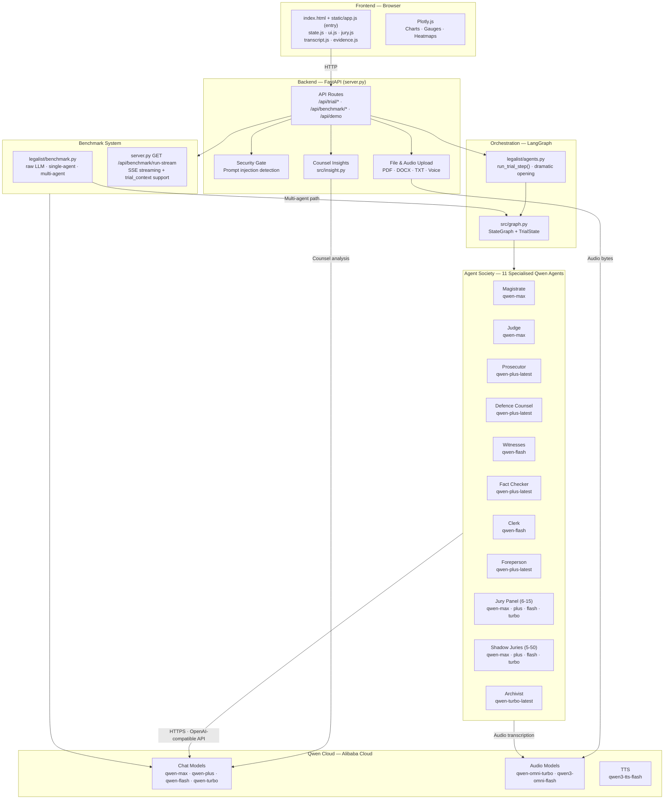

# Architecture

This document describes the system architecture, tech stack, directory layout, frontend modules, backend APIs, agent society roles, and the data flow of Codex legalist.

## Table of Contents

1. [System Overview](#system-overview)
2. [Tech Stack](#tech-stack)
3. [File / Directory Layout](#file--directory-layout)
4. [Frontend Architecture](#frontend-architecture)
5. [Backend API](#backend-api)
6. [Agent Society](#agent-society)
7. [Trial Phases](#trial-phases)
8. [Benchmark System](#benchmark-system)
9. [Counsel Insights](#counsel-insights)
10. [Jurisdiction System](#jurisdiction-system)
11. [Data Flow](#data-flow)

---

## System Overview


> Visual overview of how Qwen Cloud connects to the FastAPI backend, LangGraph orchestration, and Agent Society.



---

## Tech Stack

| Layer         | Technology                 | Purpose                                         |
| ------------- | -------------------------- | ----------------------------------------------- |
| LLM           | Qwen Cloud (DashScope)     | All generative and reasoning tasks              |
| Audio         | Qwen Omni / Qwen Audio     | Speech-to-text transcription, TTS               |
| Orchestration | LangGraph (Python)         | 18-node state machine with conditional routing  |
| Backend       | FastAPI + Uvicorn          | HTTP API server                                 |
| Frontend      | Vanilla HTML/CSS/JS        | ES module single-page application               |
| File Parsing  | pypdf, python-docx         | PDF and DOCX extraction                         |
| Charts        | Plotly.js                  | Verdict gauge, evidence visualisation           |
| Deploy        | Alibaba Cloud ECS / Docker | Production hosting (automated container runner) |

---

## File / Directory Layout

```
.
├── server.py                 # FastAPI entry point — all API routes
├── app.py                    # Demo UI server — Flask-based transcript rendering
├── deploy-docker.sh          # Docker deployment script
├── requirements.txt          # Python dependencies
├── .env.example              # Environment variable template
├── .gitignore
│
├── static/                   # Frontend (ES modules)
│   ├── app.js                # Entry point — imports all modules, bootstrap
│   ├── state.js              # State object, globals, constants, theme
│   ├── ui.js                 # All UI functions (views, navigation, benchmark)
│   ├── jury.js               # Jury logic, verdict charts, deliberation, insights
│   ├── transcript.js         # Transcript rendering
│   └── evidence.js           # Evidence display
│
├── index.html                # Single-page application HTML
│
├── src/                      # Python backend modules
│   ├── __init__.py           # Package marker
│   ├── graph.py              # LangGraph StateGraph definition
│   ├── state.py              # TrialState schema
│   ├── insight.py            # Post-trial counsel insight generation
│   ├── config.py             # Agent model mappings, constants
│   ├── prompts.py            # All LLM prompt templates
│   ├── schemas.py            # Pydantic structured output schemas
│   ├── trial_phases.py       # Phase routing helpers
│   ├── llm.py                # LLM client factory
│   ├── logger.py             # Logging configuration
│   ├── security.py           # Prompt injection detection
│   ├── audio.py              # Audio transcription
│   ├── evidence.py           # Evidence handling
│   ├── nodes.py              # LangGraph node definitions
│   ├── witness.py            # Witness agent logic
│   ├── jury.py               # Jury agent logic
│   ├── benchmark_helpers.py  # Shared benchmark utilities (safe_avg, aggregation)
│   └── dispatcher.py         # Phase routing
│
├── legalist/                 # Professional package (public API)
│   ├── __init__.py
│   ├── agents.py             # Agent invocation helpers
│   ├── benchmark.py          # Benchmark: raw LLM, single-agent, multi-agent
│   ├── data.py               # Demo case definitions + agent styling constants
│   └── parser.py             # File upload parsing (PDF, DOCX, TXT)
│
├── tests/                    # Pytest test suite
│   └── test_*.py             # Tests covering all modules
│
├── docs/                     # Documentation
│   ├── ARCHITECTURE.md       # (same content, kept for docs/ completeness)
│   ├── BENCHMARK.md           # Benchmark methodology and results
│   ├── CONTRIBUTING.md        # Contribution guide
│   ├── DEPLOYMENT.md          # Deployment guide
│   ├── USAGE.md               # User guide
│   ├── SAFETY.md              # Data handling and guardrails
│   ├── TESTING.md             # Testing guide
│   └── architecture_diagram.png
│
└── sample_cases/             # Ready-to-upload case files
```

---

## Frontend Architecture

The frontend is a **vanilla JS single-page application** organised as 6 ES modules loaded via `<script type="module">`.

### Module Responsibilities

| Module          | Lines | Responsibility                                                                                                                  |
| --------------- | ----- | ------------------------------------------------------------------------------------------------------------------------------- |
| `app.js`        | ~60   | Entry point — imports all modules, registers `DOMContentLoaded` bootstrap, exposes globals (`window.State`, `window.showToast`) |
| `state.js`      | ~255  | `State` object, `$()` shorthand, constants, theme toggle IIFE, jurisdiction data                                                |
| `ui.js`         | ~2335 | All UI — navigation, view switching, benchmark runner, trial controls, file upload, chart rendering, toast notifications        |
| `jury.js`       | ~685  | Jury grid, verdict charts, deliberation view, shadow jury conversation, **counsel insights**                                    |
| `transcript.js` | ~175  | Transcript message rendering, streaming append                                                                                  |
| `evidence.js`   | ~150  | Evidence list, exhibit display, admit/exclude toggles                                                                           |

### View System

The app switches between views by toggling `.active` class on `#view-*` divs in `index.html`:

| View ID             | Content                                                                                      |
| ------------------- | -------------------------------------------------------------------------------------------- |
| `view-setup`        | Case facts input, jurisdiction selector, demo buttons                                        |
| `view-trial`        | Live trial transcript, sidebar, metrics                                                      |
| `view-verdict`      | Verdict card → jury vote breakdown → Counsel Insights → shadow jury → sentencing → analytics |
| `view-deliberation` | Full deliberation transcript + consensus rows                                                |
| `view-benchmark`    | Benchmark runner + results table, charts, sample responses                                   |

### State Management

All state lives on `window.State` (defined in `state.js`):

```
State.caseText          — Raw case facts from setup
State.graphState        — Full trial state (transcript, verdict, evidence...)
State.trialMode         — "live" | "demo" | null
State.verdictData       — Formatted verdict display data
State.demoScript        — Pre-recorded demo transcript
State.benchmarkData     — Last benchmark run results
State.benchmarkRunning  — Whether a benchmark is in progress
State.shadowJuries      — Number of shadow juries configured
```

### Key Patterns

- **No framework** — vanilla JS with `$()` alias for `document.getElementById()`
- **Event delegation** — click handlers attached in `DOMContentLoaded` bootstrap
- **Live refresh** — `setInterval`-based polling for live trial steps
- **SSE streaming** — `EventSource` used for benchmark progress

---

## Backend API

| Method | Endpoint                    | Description                                      |
| ------ | --------------------------- | ------------------------------------------------ |
| GET    | `/`                         | Serves `index.html`                              |
| GET    | `/static/*`                 | Static assets (JS, CSS, images)                  |
| GET    | `/api/health`               | Health check                                     |
| GET    | `/api/jurisdictions`        | List supported countries + legal data            |
| POST   | `/api/demo`                 | Load a demo case, returns opening sequence       |
| POST   | `/api/trial/start`          | Start a live LLM trial                           |
| POST   | `/api/trial/step`           | Run one trial phase step                         |
| POST   | `/api/trial/magistrate`     | Run magistrate clarifying-question node          |
| POST   | `/api/trial/human_question` | Agent submits a question to the human            |
| POST   | `/api/trial/human_answer`   | Human submits an answer to an agent's question   |
| POST   | `/api/upload`               | Parse an uploaded case file (PDF/DOCX/TXT)       |
| POST   | `/api/upload_audio`         | Transcribe an uploaded audio file                |
| POST   | `/api/trial/insight`        | Generate counsel insights from a completed trial |
| GET    | `/api/trial/transcript`     | Export transcript (JSON/Markdown/TXT)            |
| POST   | `/api/benchmark/run`        | Run benchmark (POST with JSON body)              |
| GET    | `/api/benchmark/run-stream` | Run benchmark with SSE streaming progress        |

### SSE Streaming (`GET /api/benchmark/run-stream`)

Query parameters:

| Param              | Type   | Description                                |
| ------------------ | ------ | ------------------------------------------ |
| `case_description` | string | Case facts text                            |
| `num_runs`         | int    | Number of runs per approach (default 3)    |
| `use_mock`         | bool   | Use mock responses (no API calls)          |
| `trial_context`    | string | JSON-encoded `State.graphState` (optional) |

Events emitted:

| Event           | Payload                              | When                         |
| --------------- | ------------------------------------ | ---------------------------- |
| `raw_llm_start` | `{ run, total }`                     | Raw LLM query started        |
| `raw_llm_done`  | `{ response, hallucinations, time }` | Raw LLM query completed      |
| `single_start`  | `{ run }`                            | Single-agent trial started   |
| `single_done`   | `{ verdict, reasoning, time }`       | Single-agent trial completed |
| `multi_result`  | `{ verdict, source, ... }`           | Multi-agent result ready     |
| `complete`      | Full aggregate object                | All runs finished            |

When `trial_context` is provided, the multi-agent result source is `"existing_trial"` (metrics extracted from saved state — no graph re-run).

---

## Agent Society

The simulation uses 11 specialised Qwen agents, each with a distinct role and model:

| Agent           | Role                                                                                                             | Qwen Model                    |
| --------------- | ---------------------------------------------------------------------------------------------------------------- | ----------------------------- |
| Magistrate      | Analyses the case file, asks strategic pre-trial clarifying questions, identifies missing evidence and witnesses | `qwen-max`                    |
| Judge           | Rules on objections per the selected jurisdiction's evidence code, instructs the jury on the law                 | `qwen-max`                    |
| Prosecutor      | Presents evidence, examines witnesses, builds the case against the defendant                                     | `qwen-plus-latest`            |
| Defence Counsel | Challenges evidence, cross-examines witnesses, defends the accused                                               | `qwen-plus-latest`            |
| Witnesses       | Role-play agents strictly bounded to their deposition facts                                                      | `qwen-flash`                  |
| Fact Checker    | Intercepts speculative statements and forces witnesses to stay within the record                                 | `qwen-plus-latest`            |
| Clerk           | Compresses trial history into fact sheets to prevent context overflow                                            | `qwen-flash`                  |
| Jury Foreperson | Leads deliberation, manages voting rounds, detects hung juries after three rounds                                | `qwen-plus-latest`            |
| Jury Panel      | 6-15 diverse jurors deliberating and voting, using varied Qwen models for diverse perspectives                   | Random across all four models |
| Shadow Juries   | 5-50 independent juries evaluating evidence separately to compute a win-probability                              | Random across all four models |
| Archivist       | Logs key rulings and final outcomes for future case reference                                                    | `qwen-turbo-latest`           |

---

## Trial Phases

The LangGraph state machine routes the trial through 12 phases:

1. **Security Check** — Prompt injection detection on user input
2. **Magistrate Review** — Case analysis and clarifying questions
3. **Discovery** — Evidence disclosure by both sides
4. **Pre-Trial Motions** — Admissibility arguments, summary judgment
5. **Opening Statements** — Prosecution and defence present their cases
6. **Evidence Presentation** — Exhibits submitted, objections ruled upon
7. **Witness Examination** — Direct, cross, redirect, fact-checked statements
8. **Rebuttal** — Counter-evidence and surrebuttal
9. **Closing Arguments** — Final appeals to the jury
10. **Jury Instructions** — Judge explains the applicable law
11. **Jury Deliberation** — Juror discussion, voting rounds, unanimous verdict
12. **Shadow Jury & Verdict** — Parallel jury analysis, win-probability calculation, final verdict and sentencing

Each phase is a LangGraph node that can route conditionally (e.g., skip pre-trial if no motions filed, handle hung juries, trigger sentencing only on guilty/liable verdicts).

---

## Benchmark System

The benchmark compares three approaches on identical case facts:

### Approaches

| Approach         | What it does                                                 | When trial_context given                              |
| ---------------- | ------------------------------------------------------------ | ----------------------------------------------------- |
| **Raw LLM**      | Single prompt to Qwen: "What's the verdict?"                 | Prompt enriched with full trial record                |
| **Single-Agent** | One LLM handles all roles (prosecutor, defence, judge, jury) | Same enrichment                                       |
| **Multi-Agent**  | Full 11-agent LangGraph society + shadow juries              | **Skips re-run** — metrics extracted from saved trial |

### Metrics

| Metric                | What it measures                                     |
| --------------------- | ---------------------------------------------------- |
| Evidence Citations    | Count of terms like "exhibit", "witness", "evidence" |
| Hallucinations        | Facts in response not present in case description    |
| Verdict Consistency   | Agreement rate across multiple runs                  |
| Shadow Jury Consensus | Win-probability from shadow jury analysis            |
| Response Time         | Wall-clock time per run                              |

### trial_context Integration

If a trial has already been run (`State.graphState` exists with transcript + verdict):

- **Raw LLM** and **Single-Agent** receive the existing trial transcript, evidence list, closing arguments, and verdict injected into their prompts — they work from the same information the multi-agent system had.
- **Multi-Agent** extracts metrics directly from the saved trial result (`main_verdict`, transcript, `shadow_jury_results`) instead of re-running the full graph. This reduces benchmark time from minutes to seconds.

The `"Run Live (API Calls)"` button is disabled until a completed trial exists. `"Run Benchmark (Mock)"` works from case facts alone.

---

## Counsel Insights

Post-trial strategic analysis generated from the completed trial record.

### How it works

1. User clicks **"Generate Insights"** in the verdict view (positioned right after the Jury Vote Breakdown)
2. Frontend sends `State.graphState` to `POST /api/trial/insight`
3. Backend (`src/insight.py`) extracts a truncated trial context:
    - Case description (first 3000 chars)
    - Admitted evidence (last 10 items)
    - Excluded evidence (last 5 items)
    - Closing arguments (first 2000 chars)
    - Deliberation rationale (first 1000 chars)
    - Verdict
4. Three parallel LLM calls (one per perspective) generate structured advice
5. Results are cached by `sha256(case_facts + evidence + verdict + perspective)`

### Perspectives

| Perspective     | Prompt source                                | Model                             |
| --------------- | -------------------------------------------- | --------------------------------- |
| Defence Counsel | `prompts.defense_counsel_insight_prompt`     | `AGENT_MODELS["Jury Foreperson"]` |
| Prosecution     | `prompts.prosecution_counsel_insight_prompt` | same                              |
| Judge           | `prompts.judge_counsel_insight_prompt`       | same                              |

Each result returns: `summary`, `key_strengths`, `key_weaknesses`, `recommendations`.

### Cache

Results are cached server-side in `_insight_cache` (dict). Cache key is deterministic from case facts + evidence + verdict + perspective, so repeated clicks with the same data return instantly.

---

## Jurisdiction System

The simulation adapts procedure, evidence rules, and legal standards to the selected jurisdiction. Sixteen jurisdictions are supported:

- **Common Law (Adversarial):** United Kingdom, United States, Nigeria, Canada, Australia, India, Kenya, Ireland, Jamaica, Ghana, South Africa
- **Civil Law (Inquisitorial):** France, Germany, Netherlands, Brazil, China, UAE, Saudi Arabia
- **Mixed:** South Africa (Common Law + Roman-Dutch), Saudi Arabia (Islamic Law + Royal Decrees), China (Socialist Legal System)

Each jurisdiction specifies:

- **Procedure type** — Adversarial vs Inquisitorial
- **Standards of proof** — Criminal: "beyond a reasonable doubt", Civil: "preponderance of the evidence" or "balance of probabilities"
- **Evidence rules** — e.g., Federal Rules of Evidence, UK PACE, Nigerian Evidence Act
- **Jury availability** — Whether a jury (or lay judges) are used
- **Cross-examination** — Whether permitted
- **Court address** — "Your Honor", "My Lord", "Your Worship", etc.

---

## Data Flow

### Live Trial

```
User submits case facts → POST /api/trial/start
  → Prompt injection check → Magistrate review
  → LangGraph state machine iterates phases
  → Each phase: agent generates content → transcript updated
  → POST /api/trial/step frontend polls for next phase
  → Finally: verdict + shadow jury consensus
  → State.graphState populated with full trial record
```

### Benchmark

```
User clicks "Run Benchmark" → EventSource connects to GET /api/benchmark/run-stream
  → Server runs raw LLM query → SSE event raw_llm_done
  → Server runs single-agent trial → SSE event single_done
  → Server runs multi-agent (or extracts from trial_context) → SSE event multi_result
  → Server builds aggregate → SSE event complete
  → Frontend renders comparison table + charts + sample responses
```

### Counsel Insights

```
User clicks "Generate Insights" in verdict view
  → Frontend sends State.graphState to POST /api/trial/insight
  → Server extracts trial context → 3 parallel LLM calls (defence, prosecution, judge)
  → Results cached → returned to frontend
  → Frontend renders expandable insight cards for each perspective
```
